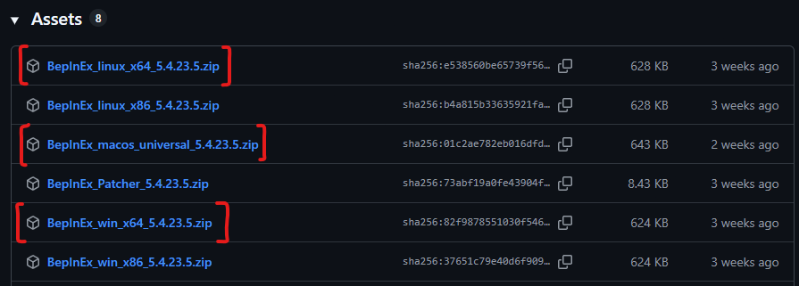
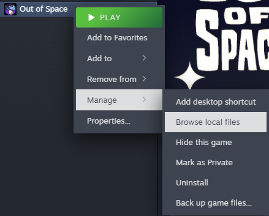
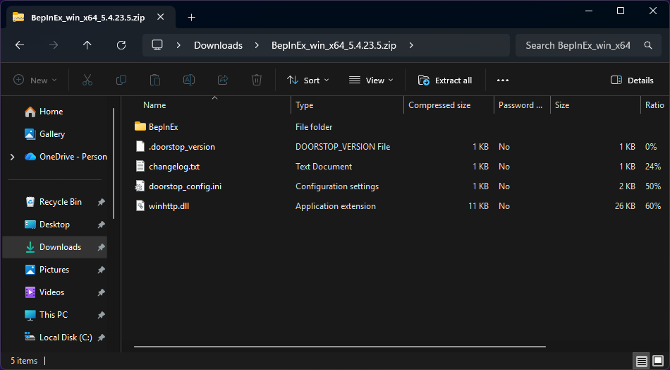
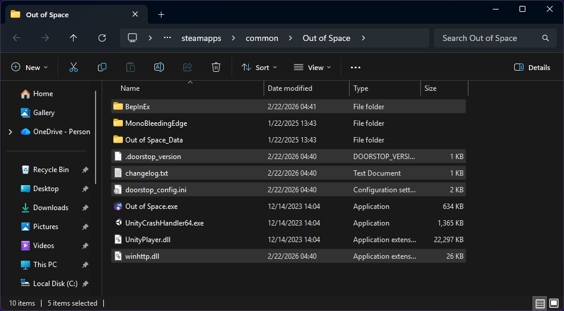
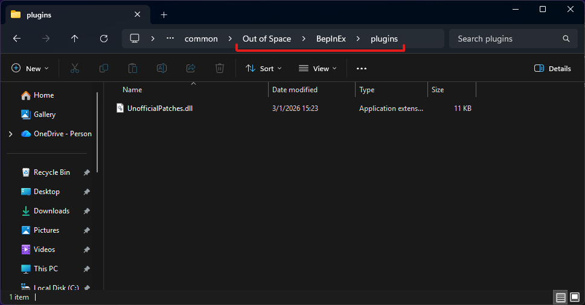

# Installation

This mod uses the BepInEx plugin/modding framework.

## 1. Install BepInEx

### 1.1 Download

Head over to the [Releases page of the BepInEx GitHub repository](https://github.com/BepInEx/BepInEx/releases) and download the latest version of BepInEx 5 (at the time of writing, `5.4.23.5`).

Download the file appropriate for your system. If you need to choose between x86 and x64 downloads, pick the x64 file.

See example screenshot

### 1.2 Extract into game directory

In your Steam library, right-click Out of Space and choose **Manage > Browse local files**. A window will open.

See example screenshot

In a separate window (or tab, on Windows 11), open the zip file you downloaded.

See example screenshot

Drag and drop (or copy) the files from the BepInEx zip file into the Out of Space directory that Steam opened.

See example screenshot

## 2. Run the game

Start Out of Space once. This lets BepInEx create its necessary config files and directories.

## 3. Install the mod

### 3.1 Download

Download the latest release `UnofficialPatches.dll` [from the Releases page](https://github.com/minimusubi/OutOfSpace-UnofficialPatches/releases).

### 3.2 Move to plugins directory

In the Out of Space directory, open the `BepInEx/plugins` directory, and move `UnofficialPatches.dll` into it.

See example screenshot

